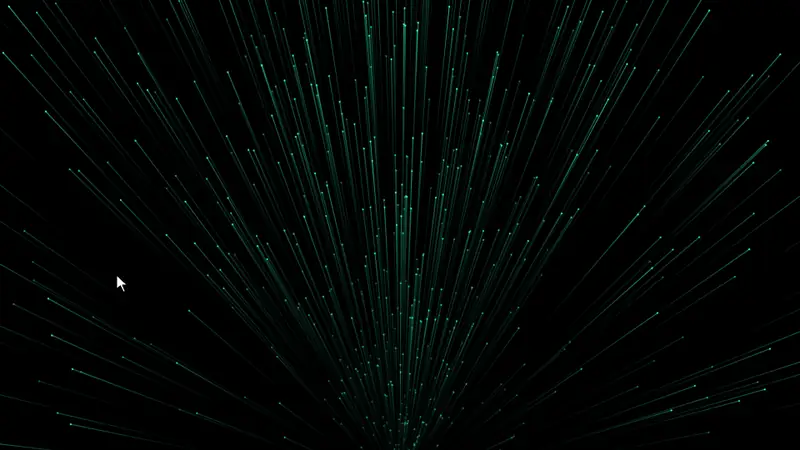

# Upstream

<p align="center">
  
</p>

<p align="center"><a href="https://upstream-fx.vercel.app"><strong>Open the live playground →</strong></a></p>

Interactive WebGL background: hundreds of hairline streaks fan upward from a point
just below the frame, each fading from a dark tail to a lit head. They part in a
rounded gap around the cursor and close again right behind it.

- **Zero dependencies**, ~8 KB gzipped
- **Three ways to use it:** React component, `<upstream-fx>` Web Component, or a vanilla JS function
- **GPU-only simulation:** two draw calls per frame, no per-frame CPU work or allocations
- **Well-behaved:** pauses off-screen and in background tabs, respects `prefers-reduced-motion`, survives WebGL context loss, falls back to the background color without WebGL

## Install

Every method below installs straight from this GitHub repository and is pinned
to the `v0.1.0` release.

### React / Next.js

```bash
npm install github:AmunM9/upstream-fx
```

```tsx
import { Upstream } from 'upstream-fx/react'

export function Hero() {
  return (
    <Upstream accentColor="#25d39b" style={{ height: '100vh' }}>
      <h1>Your headline</h1>
    </Upstream>
  )
}
```

npm builds the package from source while installing, so the first install takes a few seconds.
The component ships with `'use client'`, so you can render it from Next.js App Router server components.

### Plain HTML (Webflow, WordPress, Framer embeds…)

```html
<script src="https://cdn.jsdelivr.net/gh/AmunM9/upstream-fx@v0.1.0/dist/upstream.global.js" defer></script>

<upstream-fx accent-color="#25d39b" style="height: 100vh">
  <h1>Your headline</h1>
</upstream-fx>
```

Attributes are the kebab-case version of the options below (`repel-softness="0.8"`, `interactive="false"`).
jsDelivr serves the file from this repository's `v0.1.0` tag. For production you can add an
[SRI hash](https://www.jsdelivr.com/tools/sri) with `integrity` and `crossorigin="anonymous"`.

### Vanilla JS

```bash
npm install github:AmunM9/upstream-fx
```

```js
import { createUpstream } from 'upstream-fx'

const upstream = createUpstream(document.querySelector('canvas'), { speed: 90 })
upstream.setOptions({ accentColor: '#ff8a3d' })
upstream.destroy()
```

The canvas is sized from its CSS box, so give it a size (for example `position: absolute; inset: 0`).

### shadcn (copy the source into your project)

```bash
npx shadcn@latest add https://raw.githubusercontent.com/AmunM9/upstream-fx/v0.1.0/public/r/upstream.json
```

This copies the component and its engine into `components/upstream/`, so you own and can edit the code.

## Options

| Option | Default | Description |
|---|---|---|
| `background` | `#000000` | Canvas clear color; any hex/rgb color or `transparent` |
| `baseColor` | `#03110d` | Color near the origin (start of the ramp) |
| `accentColor` | `#25d39b` | Color far from the origin and of the head dots |
| `count` | `900` | Number of streaks (1–4000) |
| `speed` | `70` | Average speed in px/s |
| `length` | `240` | Maximum streak length in px |
| `spread` | `42` | Half-angle of the dense central cone, in degrees |
| `coneRatio` | `0.62` | Share of streaks inside the cone; the rest fill the upper half |
| `lineWidth` | `1.2` | Streak width at the head, in px |
| `dotSize` | `2.6` | Head dot diameter in px (`0` hides dots) |
| `repelRadius` | `70` | Size of the rounded gap opened around the cursor, in px |
| `repelSoftness` | `0.6` | How far the disturbance spreads beyond the gap: `0` = streaks hug the rim tightly, `1` = they part gently across a wide band and stay well spaced |
| `intensity` | `0.85` | Global brightness |
| `interactive` | `true` | React to the pointer |
| `paused` | `false` | Freeze time (pointer still works while `interactive`) |

Invalid values never throw: numbers are clamped to their range and invalid colors keep the previous value.

## How it works

Each streak stores only a seed, a phase and a speed multiplier. The vertex shader
derives everything else from the elapsed time: distance travelled, a heading that
is re-rolled every lap (70% of streaks inside a narrow cone, the rest across the
upper half), length `min(max, distance × 0.8)`, color by distance along a
two-stop ramp, and the pointer offset.

Streaks never bend near the cursor: each slides aside rigidly, which keeps
them straight. How far a streak slides depends on the distance from the cursor
to the bright part of the streak near its head (tails fade to transparent). A
streak returns to its place once its head has passed, so the gap stays rounded
and closes right behind the cursor. Heads still arriving from below are held
back under it, which makes the field split progressively.

The push amount solves `l · S(l) = d`. `S` is 0 inside the gap and eases up to 1
across a band whose width is set by `repelSoftness`, so nothing stays inside the
gap, streaks never cross, and they spread out instead of stacking on the rim. The
math is mirrored in `tests/reference/flow-model.ts`, where these properties are
unit-tested.

## Development

```bash
npm run dev            # playground at http://localhost:5173
npm test               # unit + integration tests
npm run test:coverage  # coverage (80% threshold)
npm run build          # dist/ (ESM, types, CDN bundle) + smoke test of the CDN bundle
npm run build:demo     # site/ (playground + shadcn registry under /r)
```

## Credits

Inspired by the "Connectivity Graph" component from [OriginKit](https://www.originkit.dev/).
This is an independent implementation written from scratch; no OriginKit code is used.

## License

MIT
